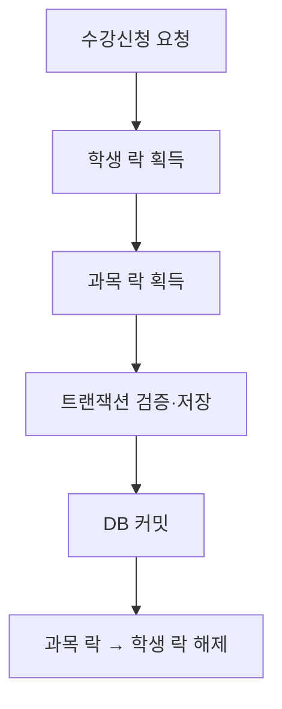

# Class Enrollment

서버가 여러 대인 수강신청 환경에서 **정원, 중복 신청, 최대 학점, 시간표 규칙을 일관되게 보장하는 방법**을 검증한 프로젝트입니다.

락이 없는 구조의 MySQL 데드락과 JVM `synchronized`의 한계를 재현하고, Redis 기반 Redisson 분산 락을 적용했습니다. 최종적으로 서버 2대와 JMeter 부하 테스트에서 정원 초과 0건을 확인했습니다.

## 핵심 결과

| 항목 | 결과 |
|---|---:|
| 인기 과목 집중 요청 | 500건 |
| 과목 정원 / 신청 성공 | 100명 / 100건 |
| 정원 초과 | 0건 |
| HTTP 409 정원 마감 | 172건 |
| HTTP 503 락 획득 실패 | 228건 |
| 학생 락 평균 대기 | 2,447.35ms |
| 과목 락 평균 대기 | 8,150.88ms |
| 실제 서비스 평균 처리 | 21.87ms |
| JMeter 평균 응답 | 14,728ms |

실제 수강신청 서비스 처리는 평균 21.87ms였지만, 단일 인기 과목에 요청이 집중되면서 과목 락 대기가 평균 8.15초까지 증가했습니다. 이를 통해 **분산 락은 정합성 해결책이지 처리량 자체의 해결책은 아니다**라는 결론을 얻었습니다.

## 문제 재현과 해결 과정

### 1. 락이 없는 구조

정원 2명인 과목에 5명이 동시에 신청했을 때 정원 초과 대신 MySQL 데드락이 발생했습니다.

- 성공: 1건
- 데드락 롤백: 4건
- 문제: 정원이 남았는데도 요청 결과가 DB의 데드락 희생자 선택에 의존

### 2. JVM `synchronized`

과목 ID별 JVM 락을 적용한 단일 서버에서는 정확히 2명만 성공했습니다. 하지만 서버를 8080과 8081 두 대로 늘리자 JVM별로 락 객체가 분리됐습니다.

| 방식 | 신청 내역 | 과목 신청 인원 | 결과 |
|---|---:|---:|---|
| `synchronized`, 서버 2대 | 3건 | 2명 | 불일치 |
| Redisson, 서버 2대 | 2건 | 2명 | 일치 |

### 3. Redisson 분산 락

모든 서버가 Redis의 동일한 락 키를 사용하도록 변경했습니다.

- `lock:student:{studentId}`: 중복 신청, 최대 학점, 시간표 보호
- `lock:course:{courseId}`: 정원과 신청 인원 보호
- 획득 순서: 학생 락 → 과목 락
- 해제 순서: 과목 락 → 학생 락
- `tryLock(10, TimeUnit.SECONDS)`: 무한 대기 방지
- 고정 leaseTime 생략: Watchdog을 통한 만료시간 연장



학생 락만 사용하면 서로 다른 학생의 동일 과목 신청이 겹치고, 과목 락만 사용하면 같은 학생의 서로 다른 과목 신청이 겹치는 것을 JUnit 동시성 실험으로 확인했습니다.

## 장애 정책

Redis 장애 상태에서 락 없이 신청을 계속하면 정합성을 보장할 수 없으므로 **Fail-closed** 정책을 선택했습니다.

| 상황 | 응답 | 수강신청 서비스 |
|---|---|---|
| 학생 락 획득 실패 | 503 `LOCK_ACQUISITION_TIMEOUT` | 실행하지 않음 |
| 과목 락 획득 실패 | 503 `LOCK_ACQUISITION_TIMEOUT` | 실행하지 않음 |
| Redis 연결 예외 | 503 `REDIS_UNAVAILABLE` | 실행하지 않음 |
| 정원 마감 | 409 `COURSE_FULL` | 저장하지 않음 |

## 기술 구성

- Backend: Java 17, Spring Boot 3.5, Spring Data JPA
- Database: MySQL 8.4, Flyway
- Lock: Redis, Redisson `RLock`
- Test: JUnit 5, Mockito, Testcontainers
- Load Test: JMeter
- Frontend: React, TypeScript, Vite
- Infrastructure: Docker Compose, GitHub Actions

## 프로젝트 구조

```text
backend/
  src/main/java/.../enrollment/
    api/            # HTTP 요청과 응답
    application/    # 분산 락과 수강신청 트랜잭션
    domain/         # Enrollment 엔티티와 Repository
  src/test/java/.../enrollment/
    application/    # 단위·동시성 테스트
    domain/         # Repository 통합 테스트
frontend/           # 수강신청 및 관리자 화면
jmeter/             # 부하 테스트 시나리오와 데이터
scripts/            # 락 대기시간 집계 스크립트
```

## 실행 방법

### 1. MySQL과 Redis 실행

```bash
docker compose up -d mysql redis
```

### 2. 백엔드 실행

Windows:

```powershell
cd backend
.\mvnw.cmd spring-boot:run
```

macOS/Linux:

```bash
cd backend
./mvnw spring-boot:run
```

상태 확인:

```http
GET http://localhost:8080/api/health
```

수강신청 요청:

```http
POST http://localhost:8080/api/enrollments
Content-Type: application/json

{
  "studentId": 1,
  "courseId": 1
}
```

### 3. 테스트 실행

Windows:

```powershell
cd backend
.\mvnw.cmd test
```

특정 심화 테스트만 실행:

```powershell
.\mvnw.cmd "-Dtest=EnrollmentRedissonFacadeTest,EnrollmentLockScopeExperimentTest" test
```

### 4. 락 대기시간 집계

JMeter 실행 후 서버 로그를 기준으로 평균, P95, 최댓값을 계산합니다.

```powershell
cd C:\portfolio\class-enrollment
.\scripts\analyze-enrollment-timing.ps1
```

결과는 다음 파일에도 저장됩니다.

```text
jmeter/results/enrollment-timing-summary.csv
```

## 결론

Redisson 분산 락으로 서버가 여러 대인 환경에서도 신청 내역과 과목 신청 인원의 정합성을 보장했습니다. 동시에 인기 과목 500건 실험에서 서비스 처리 평균은 21.87ms였지만 과목 락 평균 대기는 8.15초였습니다.

따라서 다음 개선은 락 대기시간을 단순히 늘리는 것이 아니라, 이미 마감된 과목의 빠른 거절, 사용자 재시도 정책, 메시지 큐 기반 대기열 또는 DB 조건부 갱신 방식의 비교가 되어야 합니다.
