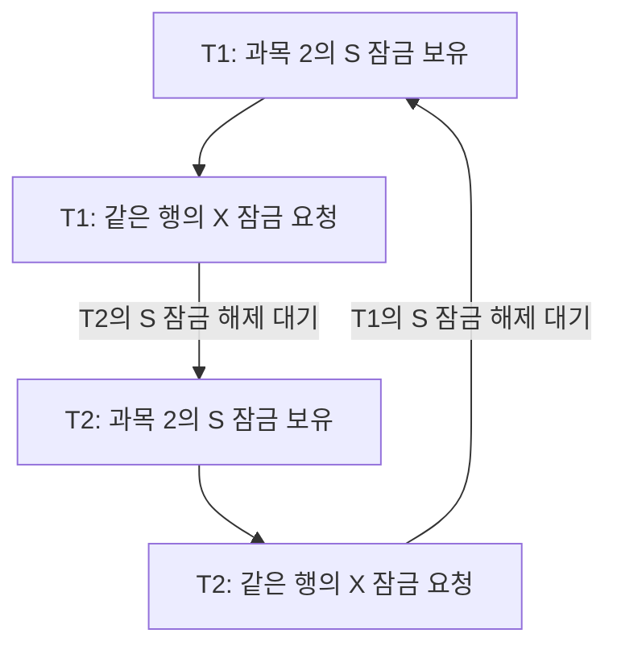

# 초기 수강신청의 외래키 잠금 승격 데드락 분석

## 분석 대상과 재현

초기 락 없는 구현 `feat/enrollment-api-no-lock`, 커밋 `1ed5e0264da90f6545935fb643fa4ed18cf0f43f`에서 분석 브랜치를 만들었다. 운영 Service, Entity, Flyway 스키마는 그대로 사용했다.

GitHub Actions의 일회용 MySQL 8.4.11, REPEATABLE READ에서 정원 2명인 과목에 서로 다른 학생 5명이 신청했다. 테스트용 Hibernate StatementInspector로 **신청 INSERT가 끝난 뒤, 과목 UPDATE를 실행하기 직전** 다섯 요청을 맞췄다. 이 제어는 충돌하는 실행 순서를 재현하기 위한 테스트 계측이다.

- 검증 커밋: `7463d817b756cfc364263d8491f612325eed4ff9`
- [성공한 CI 실행](https://github.com/skdlzl/class-enrollment/actions/runs/37443999010)
- [테스트와 검증 절차 · Draft PR #7](https://github.com/skdlzl/class-enrollment/pull/7)
- 테스트 2개 통과, 실패·오류·스킵 0개

| 실행 | 성공 | 데드락 롤백 | COURSE_FULL | 신청 내역 | enrolled_count |
|---|---:|---:|---:|---:|---:|
| 초기 Service, UPDATE 직전 동기화 | 1 | 4 | 0 | 1 | 1 |
| 같은 Service의 트랜잭션 전체를 JVM 락으로 직렬화 | 2 | 0 | 3 | 2 | 2 |

대조군의 ReentrantLock은 한 JVM 안의 트랜잭션 순차 처리를 검증한다. 다중 JVM의 과목 보호에는 프로젝트의 Redisson 공유 락을 사용한다.

## 실제 SQL 순서

학생·과목 조회와 신청 규칙 검증 다음에 실행된 쓰기 순서는 다음과 같다.

```sql
INSERT INTO enrollments (course_id, student_id) VALUES (?, ?);
UPDATE courses SET ..., enrolled_count = ?, ... WHERE id = ?;
```

`Enrollment.id`는 IDENTITY다. `enrollmentRepository.save()`에서 ID를 얻기 위해 INSERT를 실행하고, `course.increaseEnrolledCount()`로 변경한 값은 트랜잭션 커밋 시 dirty checking으로 UPDATE됐다. 원본 SQL은 `deadlock-evidence/original-sql.txt`에 기록했다.

`enrollments.course_id`에는 `courses.id`를 참조하는 외래키가 있다. INSERT에서 외래키를 확인할 때 부모인 과목 행에 **S(공유) 레코드 잠금**을 획득한다. S 잠금끼리는 함께 보유할 수 있어 다섯 INSERT가 완료됐다. 이후 각 트랜잭션의 UPDATE는 같은 과목 행에 **X(배타) 레코드 잠금**을 요청한다.

## 잠금 로그로 확인한 순환 대기

UPDATE 실행 전 `performance_schema.data_locks`에서 다음 조건의 잠금 5개를 확인했다.

```text
OBJECT_NAME=courses
INDEX_NAME=PRIMARY
LOCK_TYPE=RECORD
LOCK_MODE=S,REC_NOT_GAP
LOCK_STATUS=GRANTED
LOCK_DATA=2
```

트랜잭션 ID는 1869, 1870, 1873, 1874, 1875였다. 같은 기본키 행 `courses.id=2`에 각각 S 잠금을 보유했다.

`SHOW ENGINE INNODB STATUS`의 마지막 데드락은 다음 두 트랜잭션을 기록했다.

| 트랜잭션 | 보유 잠금 | 기다리는 잠금 | 대상 |
|---|---|---|---|
| 1873 | S, record, not gap | X, record, not gap | courses PRIMARY, id=2 |
| 1874 | S, record, not gap | X, record, not gap | courses PRIMARY, id=2 |



T1의 X 잠금은 T2의 S 잠금 해제를 기다리고, T2의 X 잠금은 T1의 S 잠금 해제를 기다린다. **같은 SQL 순서로 실행해도 동일 행의 S → X 잠금 승격에서 순환 대기가 생긴다.**

MySQL은 희생 트랜잭션을 롤백해 순환 대기를 해소했다. 애플리케이션에서 Error 1213 / SQLState 40001을 4건 확인했고, 최종 성공·신청 내역·인원수는 1이었다. 정원 2명 중 한 자리가 남았다.

## 설계에 연결한 판단

과목 조회·정원 검증·신청 INSERT·인원 UPDATE·커밋을 과목별로 순차 처리하면, 여러 신청 트랜잭션이 같은 과목의 S 잠금을 함께 가진 채 X 잠금으로 승격하는 경로를 차단할 수 있다. 대조군에서 이 범위를 보호해 성공 2건과 COURSE_FULL 3건을 확인했다.

따라서 과목 락은 인원 증가 직전부터가 아니라 **신청 INSERT 전부터 커밋 완료까지** 유지한다. Facade가 트랜잭션 Service를 호출하고, 커밋 후 반환되면 락을 해제하는 구조에 연결된다.

학생 락은 서로 다른 과목을 동시에 신청하는 같은 학생의 학점·시간표를 보호한다. 이번 데드락에서 확인한 충돌 대상은 같은 과목의 DB 행이었다.

## 근거 파일

- `deadlock-evidence/environment.txt`: MySQL 버전과 격리 수준
- `deadlock-evidence/original-sql.txt`: 초기 Service의 쓰기 순서
- `deadlock-evidence/before-update-locks.txt`: UPDATE 전 과목 행의 S 잠금 5개
- `deadlock-evidence/innodb-status.txt`: 보유 S / 대기 X / 롤백 트랜잭션
- `deadlock-evidence/original-outcomes.txt`, `original-final-state.txt`: 데드락 실행 결과
- `deadlock-evidence/serialized-outcomes.txt`, `serialized-final-state.txt`: 직렬 처리 대조군
- `deadlock-evidence/serialized-sql.txt`: 대조군 SQL

[MySQL 8.4 공식 문서 · SQL별 InnoDB 잠금](https://dev.mysql.com/doc/refman/8.4/en/innodb-locks-set.html)의 외래키 검증 S 잠금 및 UPDATE 잠금 동작과 실제 로그를 대조했다.
